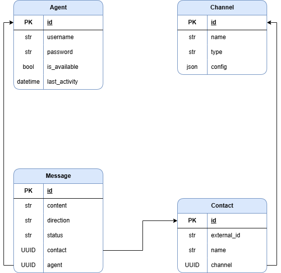
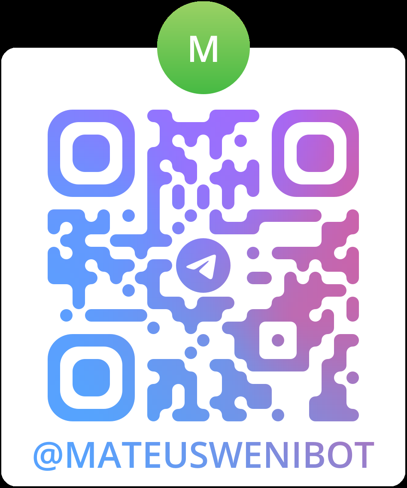
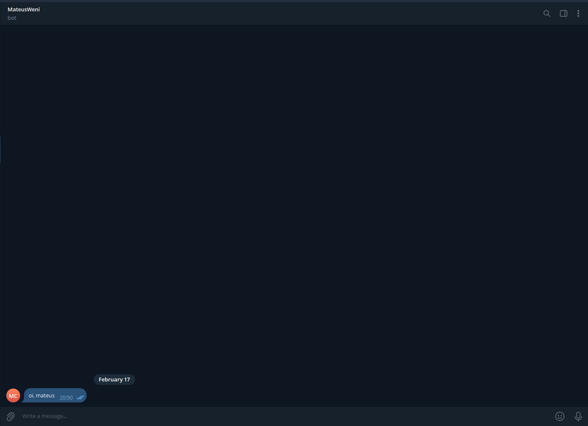
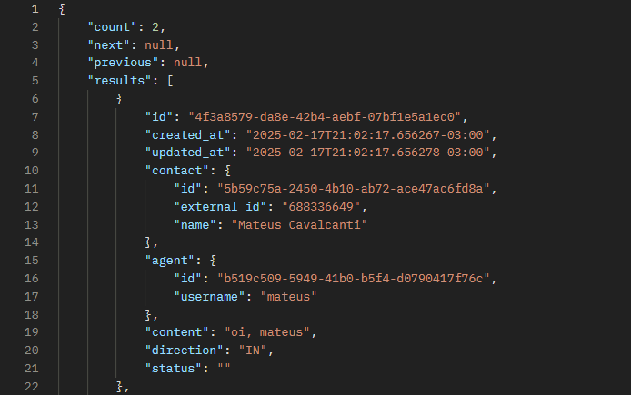

# Desafio Técnico Weni
**Elaborado por Mateus Cavalcanti**
Este repositório contém o código necessário para a realização do desafio da Weni para executar os dois fluxos sugeridos:

**Fluxo 1**
- Um contato envia uma mensagem para um chatbot através de um dos canais
de comunicação configurados;
- O canal de comunicação, vamos tomar o Telegram como exemplo, envia uma
chamada webhook contendo o conteúdo da mensagem;
- O sistema processa a mensagem e a persiste em seu banco de dados

**Fluxo 2**
- A partir de uma API REST fornecida pelo seu sistema um atendente humano
envia uma requisição contendo um identificador do contato e mensagem;
- O sistema persiste a mensagem e a envia para o contato pelo respectivo canal.

## Features
Abaixo estão listados os requisitos necessários e diferenciais implementados neste repositório:
- Camada de abstração para canais;
- Canais de comunicação: Telegram, **Whatsapp** e Mock;
- Persistência: Modelos ORM de Contact, Channel, Agent e Message;
- API para receber Webhook do telegram e whatsapp;
- API para enviar mensagem para um contato;
- API para listar mensagens paginadas;
- Testes unitários e testes de e2e;
- Documentação de endpoints com Swagger;
- Autenticação com JWT;
- Cache para perguntas frequentes;
- Poetry como gerenciador de dependências;
- Docker e Docker-compose para orquestramento de serviços;
- Celery para apagar mensagens criadas a mais de um mês;
- Pipeline CI/CD;
- Proteção HTTPS;
- Deploy na EC2 da AWS.

## Tecnologias
Para este projeto foram utilizadas as seguintes tecnologias:
- PostgreSQL como banco de dados;
- RabbitMQ para fila de tarefas;
- Django, Django REST, Django-Filter, DRF-Spectacular para API e documentação;
- Celery para tasks;
- Twilio e Telegram para lidar com canais e webhooks;
- Gunicorn para servidor WSGI.
- Docker e Docker-compose para orquestramento de serviços;
- Github-actions e AWS EC2 para CI/CD e Deploy;
- Nginx para HTTPS e proxy reverso.

## Modelo relacional
O banco de dados da aplicação foi projetado de modo relacional para que fosse possível persistir os dados relevantes e manter um controle da relações entre os modelos. O diagrama abaixo mostra o modelo relacional adotado.


## Rotas
Os endpoints da API fornecem métodos para lidar com agentes, mensagens, contatos e canais.

**Agente**
| Nome | Método HTTP | URL | Parâmetros | Parâmetros obrigatórios do body  | Permissões |
|------|-------------|-----| ---------- | -------------------------------- | ---------- |
| Criar agente | POST | api/v1/agents/ | | "username", "password"          |            |
| Ler agente | GET | api/v1/agents/:pk/ | |                                | IsAuthenticated |
| Listar agentes | GET | api/v1/agents/ |  |                               | IsAuthenticated |
| Atualizar agente | PATCH | api/v1/agents/:pk | |                         | IsAuthenticated, IsAgentSelf |
| Excluir agente | DELETE | api/v1/agents/:pk/ | |                         | IsAuthenticated, IsAgentSelf |

**Exemplo de criação de agente**
```json
{
    "username": "mateus",
    "password": "admin123"
}
```

**Autenticação**
| Nome | Método HTTP | URL | Parâmetros | Parâmetros obrigatórios do body  | Permissões |
|------|-------------|-----| ---------- | -------------------------------- | ---------- |
| Criar token JWT | POST | auth/token/  | | "username", "password"         |            |
| Atualizar token JWT | POST | auth/token/refresh/ | | "refresh" |         |            |

**Exemplo de criação de token**
```json
{
    "username": "mateus",
    "password": "admin123"
}
```

**Contact**
| Nome | Método HTTP | URL | Parâmetros | Parâmetros obrigatórios do body  | Permissões |
|------|-------------|-----| ---------- | -------------------------------- | ---------- |
| Listar contatos | GET | api/v1/contacts/ | | | IsAuthenticated |
| Ler contato | GET | api/v1/contacts/:pk/ | | | IsAuthenticated |

**Messages**
| Nome | Método HTTP | URL | Parâmetros | Parâmetros obrigatórios do body  | Permissões |
|------|-------------|-----| ---------- | -------------------------------- | ---------- |
| Enviar mensagem | POST | api/v1/messages/ | | "content", "contact_id"| IsAuthenticated |
| Listar mensagens | GET | api/v1/messages/ | "contact_id", "agent_id" | | IsAuthenticated |
| Ler contato | GET | api/v1/messages/:pk/ | | | IsAuthenticated |

**Exemplo de criação de mensagem**
```json
{
    "content": "Oi!",
    "contact_id": "e0fbd40a-7acf-4d20-be65-44198c863d46"
}
```

**Channels**
| Nome | Método HTTP | URL | Parâmetros | Parâmetros obrigatórios do body  | Permissões |
|------|-------------|-----| ---------- | -------------------------------- | ---------- |
| Listar canais | GET | api/v1/channels/ | | | IsAuthenticated |
| Ler canal | GET | api/v1/channels/:pk/ | | | IsAuthenticated |

Na raíz do projeto, é possível conferir uma [collection do Postman](./API%20Test.postman_collection.json). Dessa maneira, é possível criar um ambiente com as configurações necessárias para realizar requisições. Ademais, para rotar com autenticação é necessário informar o token JWT no header (Bearer Token).

**Documentação Swagger**
Para visualizar a documentação dos endpoints da API deve-se acessar em um navegador a rota /api/v1/docs/

## Setup local do projeto
Para o setup local do projeto é necessário configurar as variáveis de ambiente descritas no .env.example. Esta ação pode ser um pouco complicada pois envolve gerar tokens de autenticação usando o BotFather do telegram e o Twilio para gerar tokens do WhatsApp.

Além do mais, é necessário utilizar o Ngrok para criar um túnel seguro para comunicação do bots com os endpoints da API.

No geral, uma vez configurado o Ngrok deve-se criar o arquivo .env, como mostra o exemplo:

```
DEBUG=False
DB_NAME=test
DB_USER=test
DB_PASSWORD=test
DB_HOST=database
DB_PORT=5432
DJANGO_SECRET_KEY=django-insecure-=@poz$bfb^y(^9+8!wq)gvoi*t^y6zzo1bgz2zg6d*(!5=t5+_
TELEGRAM_BOT_TOKEN=1234567890:ABCdEfGhIjKlMnOpQrStUvWxYz123456789 (token aleatório)
WHATSAPP_ACCOUNT_SID=AC1234567890abcdef1234567890abcdef (token aleatório)
WHATSAPP_AUTH_TOKEN=a1b2c3d4e5f6g7h8i9j0klmnopqrstuv (token aleatório)
WHATSAPP_FROM_NUMBER=+15355224186 (número aleatório)
BASE_URL=https://a0af-187-105-31-201.ngrok-free.app (url fornecida pelo ngrok)
RABBITMQ_USER=myuser
RABBITMQ_PASSWORD=mypassword
RABBITMQ_HOST=rabbitmq
```

Isto posto, basta executar o Docker com
```bash
$ docker-compose up --build
```
Ou, para versões mais recentes do Docker
```bash
$ docker compose up --build
```

Quando a aplicação estiver funcionando será possível realizar requisições no localhost.

## Setup de produção do projeto
Este projeto está atualmente em produção em uma instância AWS EC2 a partir de uma pipeline CI/CD configurada neste repositório. É possível realizar requisições para esta API por meio do domínio `https://matscats.cloud/` e acessar os endpoints normalmente.

Por exemplo, para criar um agente pode-se acessar `https://matscats.cloud/api/v1/agents/`

Além disso, o Bot do telegram pode ser encontrado pesquisando no telegram o `@MateusWeniBot` ou por meio do QRCode abaixo.


Também é possível enviar mensagens para o bot do WhatsApp por meio do número `+1 (415) 523-8886`

**Exemplo**
Na figura abaixo é enviada uma mensagem para o bot do telegram


É possível ver que na API foi criada a mensagem
